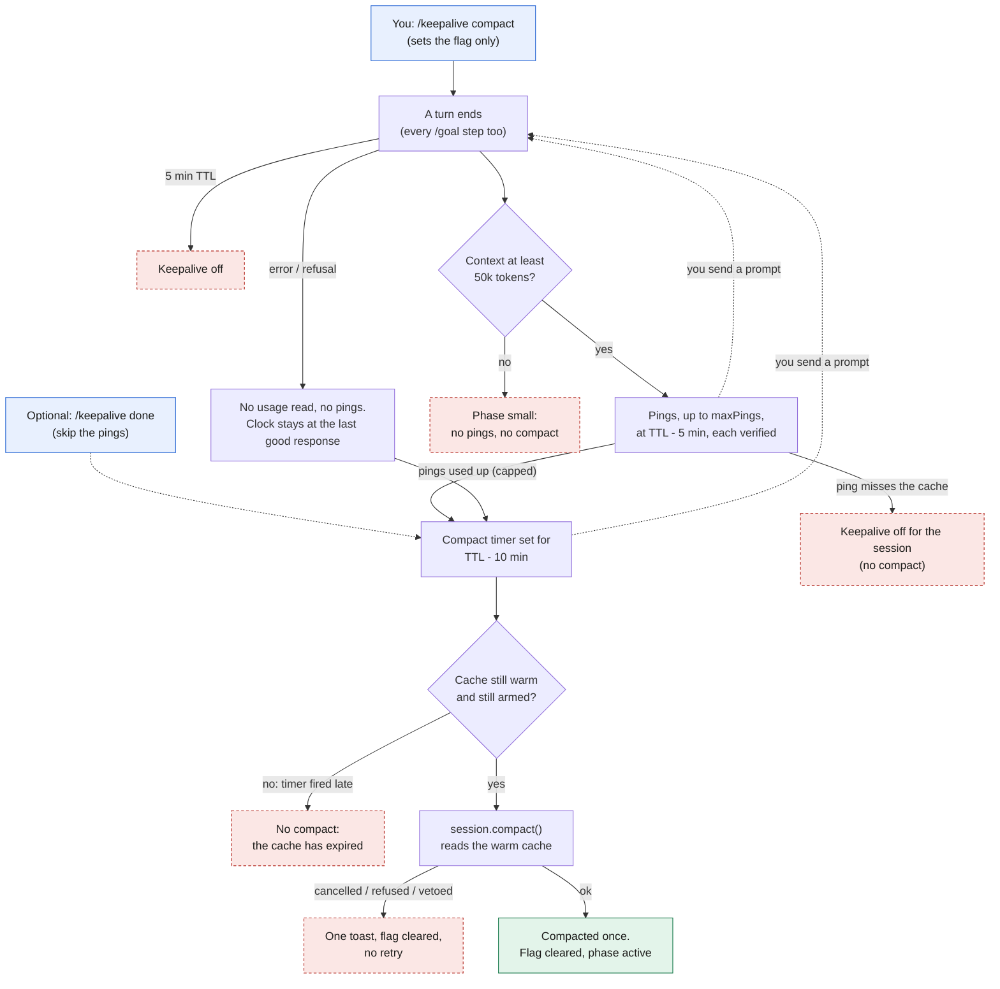

# cache-keepalive

Keeps the main thread's prompt cache warm while you are away. About five minutes before the cache TTL runs out, it sends one tool-less fork of the conversation (`$.model.fork`) that re-reads the cached prefix and restarts the TTL. The ping never lands in the transcript, so nothing needs rewinding.

By default it pings at most twice per idle stretch, so a lunch or a meeting comes back to a warm cache. Every ping is verified: if the fork does not read the prefix from cache, keepalive turns itself off for the session.

Requires **Claude Code 2.1.289** or later (hook-module plugin API). The status widget targets **ccstatusline 2.2.30**.

## Quick setup

Nothing is required: once the plugin loads, it keeps the cache warm. The rest is optional.

| You want | Set up | |
|---|---|---|
| Keepalive itself | Load the plugin (below) | required |
| The state always on screen | A status line field and a refresh interval ([Seeing the state](#seeing-the-state)) | optional; `/keepalive status` works without it |
| A Telegram question once the pings run out | Bot token **and** `telegramChatId` ([Telegram](#telegram-optional)) | optional; both are needed, or nothing is sent |
| Only your own answers to count | `telegramUserId` | optional; without it anyone in the chat can answer |

Load the plugin, one of:

```bash
# every session: add the folder to CLAUDE_CODE_PLUGIN_DIRS in ~/.claude/settings.json ("env" block),
# separated by ":" from any folders already listed
"CLAUDE_CODE_PLUGIN_DIRS": "/absolute/path/to/plugins/cache-keepalive"

# one session only
claude --plugin-dir /absolute/path/to/plugins/cache-keepalive
```

Then set options with `/plugin configure cache-keepalive` (sensitive ones included) or `/config` (search for `keep`). A session started with `--plugin-dir` reads them from `pluginConfigs["cache-keepalive"].options` in settings.

Check it: `/keepalive status` shows the phase, the TTL it read, and `telegram: on` when Telegram is set up.

## Cost

A ping is not free: it re-reads the whole prefix at the cache-read rate. That rate depends on the model, and a rewrite after expiry is charged at the cache-write rate (2× input for the 1h TTL). Prices per million tokens, from [the pricing page](https://platform.claude.com/docs/en/about-claude/pricing) (checked 2026-10-07):

| Model | Input | 1h cache write | Cache read |
|---|---|---|---|
| Claude Fable 5.1 | $10 | $20 | $0.25 (0.025×) |
| Claude Opus 5.5 | $4 | $8 | $0.20 (0.05×) |
| Claude Sonnet 5.5 | $2 | $4 | $0.20 (0.1×) |

With a 142k-token context and the 1h TTL:

| | Fable 5.1 | Opus 5.5 | Sonnet 5.5 |
|---|---|---|---|
| One ping | $0.036 | $0.028 | $0.028 |
| Default cap, 2 pings | $0.071 | $0.057 | $0.057 |
| One rewrite after expiry (1h write) | $2.84 | $1.14 | $0.57 |
| 2 pings as a share of one rewrite | 2.5% | 5% | 10% |

The ratio does not depend on the context size, so keeping warm pays off when there is more than a 2.5–10% chance you come back before the pings run out. The same prices make compact-before-expiry cheap: the summary request reads the warm cache instead of paying a rewrite.

**How long is it worth keeping warm?** Pings cost as much as one rewrite after about (1h write price ÷ cache-read price) pings, one every 55 minutes. This does not depend on context size, and the pricing page gives the same numbers for every model but two:

| Model | Break-even | About |
|---|---|---|
| Claude Fable 5.1, Mythos 5.1 (read 0.025× input) | 80 pings | 73 h |
| Claude Opus 5.5 (read 0.05×) | 40 pings | 37 h |
| Every other model: Fable 5, Mythos 5, Opus 5 and 4.x, Sonnet 5.5, 5 and 4.x, Haiku 4.5 and 3.5 (read 0.1×) | 20 pings | 18 h |

Past that, the pings cost more than the single rewrite they avoid. It only pays if you are sure to come back, so the default stays at 2 pings; `/keepalive brb` adds a note to its reply when you ask for more than the break-even for the model in use.

Sessions under 50k tokens of context are not kept warm, since a rewrite is cheap there. A **5-minute TTL** turns keepalive off. That rule assumes the 0.1× read rate: about 13 pings an hour is 1.3× input, more than one 1.25× rewrite. On Opus 5.5 (0.05×) and Fable 5.1 (0.025×) the same 13 pings would cost 0.65× and 0.33×, so the rule is conservative there. The Telegram question also estimates "one more hour warm" at 0.1×.

The TTL is read, not assumed: the turn's `usage` has no 1h/5m split, so the plugin reads `cache_creation.ephemeral_1h_input_tokens` / `ephemeral_5m_input_tokens` from the transcript tail.

## Commands

| Command | What it does |
|---|---|
| `/keepalive status` | Phase, TTL, context size, pings so far, next ping and expiry times |
| `/keepalive brb <minutes or hours>` | Keep warm for longer this idle stretch, e.g. `brb 180` allows 4 pings. Resets at your next prompt |
| `/keepalive done` | Stop for this idle stretch. Resets at your next prompt |
| `/keepalive compact` | Arm a one-time compact for when keepalive runs out: it compacts in the lead window before the cache expires. Survives `/goal` turns; `/keepalive compact off` cancels. To compact now, use the built-in `/compact` |

Typing `/keepalive brb ` completes the minutes inline, fish-style: a dim `180` appears, and typing `4` or `6` turns it into `480` or `60`. Right arrow accepts; Enter runs what the box shows, completion included. Tab and Up/Down are kept by the editor and never reach the plugin, so there is no cycling. Pasting or very fast typing can outrun the completion: the next key may land before the dim tail is drawn.

When you come back to an expired cache, a one-line band above the prompt says how much the next request will rewrite. It disappears when you send a prompt or press Dismiss.

## Options

Set in `/config` (or `pluginConfigs["cache-keepalive"].options` in settings):

| Option | Default | |
|---|---|---|
| `enabled` | `true` | Master switch |
| `leadMinutes` | `5` | Ping this many minutes before the TTL runs out |
| `compactLeadMinutes` | `10` | An armed compact starts this many minutes before the TTL runs out. Earlier than a ping because compacting a big context takes minutes (about 1 minute at 140k tokens, measured once) |
| `maxPings` | `2` | Pings per idle stretch |
| `minContextTokens` | `50000` | Smaller contexts are not kept warm |
| `compactBeforeExpiry` | `false` | Always compact in the lead window once the pings run out, without arming each time (see below) |
| `engineStatus` | `false` | Show the state as a status entry under the prompt, for sessions without a status line (see below) |
| `telegramBotToken` | empty | Bot token (sensitive); see Telegram below |
| `telegramChatId` | empty | Chat that receives the question |
| `telegramUserId` | empty | Only this user's answers count |

## Compact before expiry

For when you step away, or leave a `/goal` running while you sleep: run `/keepalive compact` first. Keepalive keeps pinging as usual; once the pings run out, it compacts `compactLeadMinutes` (10) before the cache expires instead of letting it lapse. The summary request only has to start before the expiry, but the extra minutes absorb a retry or a late timer. The summary request is a fork of the same prefix and reads the warm cache: one measured run on a 142k-token context read 98% of the prefix from the cache and wrote 526 tokens. Your next prompt then rewrites a small summary instead of the whole old context.

- **No pings, just the compact.** Add `/keepalive done` (before or after): the pings stop and the compact runs in the first lead window, about 50 minutes after the last turn on a 1h TTL. `done` ends at your next prompt, though, so a `/goal`'s first turn brings the pings back; for a goal use `maxPings: 0` instead.
- **One time.** It fires once, then clears. `/keepalive compact off` cancels it.
- **It clears when you come back.** A plain prompt you type (not a slash command) cancels it and shows a toast, so it cannot fire in some later idle stretch you forgot about. A slash command does not count (you arm it, then type `/goal`), and neither does a prompt the engine wrote, such as a `/goal` continuation (its `source` is not `user`). Some builds leave `source` out; there, a `/goal` continuation was measured to raise no prompt event at all, so only what you type clears it. New turns do not drop it, so a `/goal` does not either; the idle countdown only starts after the goal ends.
- It fires only in the `capped` phase, so `brb` or a Telegram answer that adds pings postpones it. If the timer fires after the cache already expired (the Mac slept), it does nothing. If you cancel the compaction or the host refuses it, it is not retried.
- Set the `compactBeforeExpiry` option to make it the default for every idle stretch instead of arming it each time. Set `maxPings` to `0` to compact at the first lead window with no pings.
- After it runs, nothing is kept warm until your next turn: the new prefix is not cached yet.
- `/keepalive status` shows `compact before expiry: armed, at HH:MM`.

### Flow chart



Solid arrows are the main path, dashed arrows are optional or restart it. Red boxes end early: nothing is compacted and the cache expires on its own. Typing a prompt at any point cancels the timers. A plain prompt also clears the armed flag; a slash command or a `/goal` continuation keeps it, and the flow restarts when that turn ends.

### Timeline

Times are minutes after the last turn ends, with the defaults: 1h TTL, `leadMinutes` 5, `compactLeadMinutes` 10, `maxPings` 2, and `/keepalive compact` armed.

```mermaid
gantt
  title Time after the last turn ends (hh:mm, defaults, compact armed)
  dateFormat HH:mm
  axisFormat %H:%M
  section Cache
    Warm, nothing happens             :done, w1, 00:00, 55m
    Ping 1, cache now lasts to 1h55   :milestone, p1, 00:55, 0m
    Warm after ping 1                 :done, w2, 00:55, 55m
    Ping 2, pings used up, lasts to 2h50 :milestone, p2, 01:50, 0m
    Warm after ping 2                 :done, w3, 01:50, 50m
  section Compact
    Compact window, starts at 2h40    :crit, c, 02:40, 10m
    Old cache would have expired      :milestone, x, 02:50, 0m
```



The axis is time since the last turn ended, drawn to scale. The red bar is the 10-minute window `compactLeadMinutes` leaves before the cache would expire, not how long the compaction takes (about a minute at 140k tokens).

- **0 → 55:** nothing happens. The cache is warm and the clock runs from the last response.
- **55 and 110:** each ping reads the whole prefix, which restarts the 60-minute clock, so the cache would now expire at 115, then at 170. A ping starts `leadMinutes` (5) before the current expiry, hence a 55-minute interval.
- **After ping 2** the pings are used up (`capped`), so the compact is scheduled for the second lead window: expiry 170 − `compactLeadMinutes` 10 = **160**.
- **160:** the summary request starts and reads the warm cache. It takes about a minute at 140k tokens (more on a bigger context), so it is done well before 170. The cache now holds a prefix that no longer exists, and nothing is kept warm.
- **After 160:** your next prompt rewrites the small summary instead of the old context.

The same rule gives these variants (still minutes after the last turn):

| Setup | Pings | Compact |
|---|---|---|
| `/keepalive compact` (above) | 55, 110 | 160 |
| `maxPings` 0 | none | 50 |
| `/keepalive done` then `/keepalive compact` | none | 50 |
| `/keepalive brb 180` then `/keepalive compact` | 55, 110, 165, 220 | 270 |
| you send a prompt at any point | cancelled | cancelled, still armed; the timeline restarts when that turn ends |

The formula is `last response + pings × 55 + (60 − compactLeadMinutes)` minutes. `/keepalive status` and the status line show the result as a clock time, for example `✂13:13`. It is an estimate: if a ping misses the cache, keepalive turns itself off for the session and no compact happens.

## Telegram (optional)

When the pings run out while you are away, keepalive can ask on Telegram:

```
myproject · refactor-auth
🧊 Cache expires at 01:12 · 180k context
Rewrite ≈ 360k · one more hour warm ≈ 18k
Tap a button, or reply with minutes (e.g. 120).
[+1h] [+3h] [Let it expire]
```

`+1h` adds one ping (55 minutes on a 1h TTL), `+3h` three. A text reply to the message works too: `120`, `2h`, `45m`, `stop`. Once answered, or when you come back, the cache expires, or you run `/keepalive done`, the message shows the outcome and loses its buttons.

Setup:

1. Use any bot you own, including the one session-notifier posts with. Its privacy mode must be on (the default; `getMe` reports `can_read_all_group_messages: false`) and it must have no webhook (`getWebhookInfo` url empty).
2. Store the token, in one of three places (checked in this order):
   - **The `telegramBotToken` option.** Set it with `/plugin configure cache-keepalive` inside Claude Code: a sensitive option, kept in secure storage rather than `settings.json`. Best once the plugin is installed from a marketplace. (`claude plugin install … --config telegramBotToken=…` works too, but leaves the token in your shell history.)
   - **The `CLAUDE_KEEPALIVE_TELEGRAM_BOT_TOKEN` environment variable.** Avoid it outside CI: it sits in plain text in a settings or profile file, and every process Claude Code starts inherits it, so one `env` run by the model puts the token in the transcript.
   - **The macOS Keychain.** Encrypted, in no file and no environment. The plugin reads it once per session. Best while loading the plugin with `--plugin-dir`:
     ```bash
     security add-generic-password -s claude-code.cache-keepalive -a telegram-bot-token -w   # prompts for the token
     security delete-generic-password -s claude-code.cache-keepalive -a telegram-bot-token   # to remove it
     ```
3. Set `telegramChatId` (a group's id is negative) and `telegramUserId` (only your presses count) with `/plugin configure cache-keepalive` or in `/config`. Telegram turns on once both the token and `telegramChatId` are set; `telegramUserId` is optional (without it, anyone in the chat can answer). To find both, reply to one of the bot's messages in the chat, then read the pending update without the token showing up in your shell history:
   ```bash
   read -rs TOK
   curl -s "https://api.telegram.org/bot$TOK/getUpdates?timeout=0" | jq '[.result[].message | {chat: .chat.id, user: .from.id, text}]'
   unset TOK
   ```

How answers arrive: Claude Code cannot receive pushes, so while a question is open the plugin polls `getUpdates` every 10 seconds. It never confirms an offset, because other sessions and machines may share the bot and confirming would delete their answers. Each reader takes only updates carrying its own session id. With privacy mode on, only button presses and replies are pending, and Telegram drops them after 24 hours.

## Seeing the state

Keepalive works without any status line. With none, you see it through `/keepalive status`, the expired band, and a toast if it turns itself off. For an always-visible state, pick the setup that matches yours.

The plugin writes its state to `~/.claude/keepalive/<session_id>.json`. `bin/keepalive-cache` turns that into a cache field:

```
🟢58:54 kp 1/2
```

- The countdown runs from the later of the transcript's last assistant message and the last ping, with the TTL the plugin read. Counting from the transcript alone, as ccstatusline's built-in Cache Timer does, would fall to `❄️ COLD` after a ping while the cache is still warm: pings never reach the transcript.
- The tag after it: `kp 1/2` (keepalive: pings used / cap), `⏸` (capped or stopped), `kp off` / `kp off·5m`. Emoji and text are joined with no space to save width.
- An armed compact adds `✂03:12` (the clock time it is due), or `✂armed` while nothing is scheduled yet, for example during a `/goal` turn: `🔥HOT ✂armed`. It clears once the compact has run, when you send a plain prompt, or with `/keepalive compact off`.
- With no state file it prints what ccstatusline's built-in Cache Timer prints.

It reads the JSON Claude Code passes to every status line command (`session_id`, `transcript_path`), so it works with any of the setups below. It needs `node` on the `PATH` the status line runs with. `--ttl <seconds>` is the TTL assumed until the plugin has read the session's own (default 3600).

**All three need a refresh interval.** Claude Code redraws the status line only on events, and nothing happens while you are idle. Set `statusLine.refreshInterval` in `~/.claude/settings.json` (30 seconds is enough); ccstatusline's **Refresh interval** menu item writes the same setting.

### ccstatusline

In `~/.config/ccstatusline/settings.json`, replace the `cache-timer` item with a custom command item:

```json
{
  "id": "keepalive-cache",
  "type": "custom-command",
  "color": "yellow",
  "commandPath": "/absolute/path/to/plugins/cache-keepalive/bin/keepalive-cache --ttl 3600"
}
```

Keep ccstatusline's custom-command cache TTL at `0` (the default), or the field shows stale output.

### Your own status line script

Pass the same stdin to `keepalive-cache` and print its output where you want it:

```sh
#!/bin/sh
input=$(cat)
model=$(printf '%s' "$input" | jq -r '.model.display_name')
cache=$(printf '%s' "$input" | /absolute/path/to/plugins/cache-keepalive/bin/keepalive-cache)
printf '%s │ cache %s' "$model" "$cache"
```

### No status line

Either make `keepalive-cache` the whole status line:

```json
"statusLine": {
  "type": "command",
  "command": "/absolute/path/to/plugins/cache-keepalive/bin/keepalive-cache",
  "refreshInterval": 30
}
```

or turn on the `engineStatus` option. Claude Code then shows the state as a plugin status entry under the prompt, such as `keep 1/2 · ping 23:22`. It needs no setup, but the engine draws it on a row of its own with a warning-style prefix and the plugin's name. It shows clock times, not a countdown, because it only updates when the state changes. It is empty while you work.

## Limits

- No pings while the Mac sleeps: the process is asleep too. A timer that fires after the cache already expired skips the ping.
- A turn that ends in an `error` or `refusal` reads no usage and runs no pings, but an armed compact is still scheduled from the last good response, so a `/goal` that dies on an API error does not lose it.
- A turn waiting on a permission prompt has not finished, so no ping is scheduled during it.
- After a prefix change (`/model`, a plugin reload that changes the system prompt or tools) the next ping misses once, and keepalive turns off for the session.

## Development

Design, decisions and their evidence: [docs/PRD.md](docs/PRD.md).

```bash
claude plugin validate plugins/cache-keepalive
claude --plugin-dir plugins/cache-keepalive   # once, so the engine lays .claude-plugin/types/ for tsc
tsc -p plugins/cache-keepalive
claude plugin test plugins/cache-keepalive    # hook tests (tests/*.test.ts)
node --test plugins/cache-keepalive/tests/widget.test.cjs   # status widget tests
```

Not yet in `marketplace.json`: run it with `--plugin-dir` for a week first.
