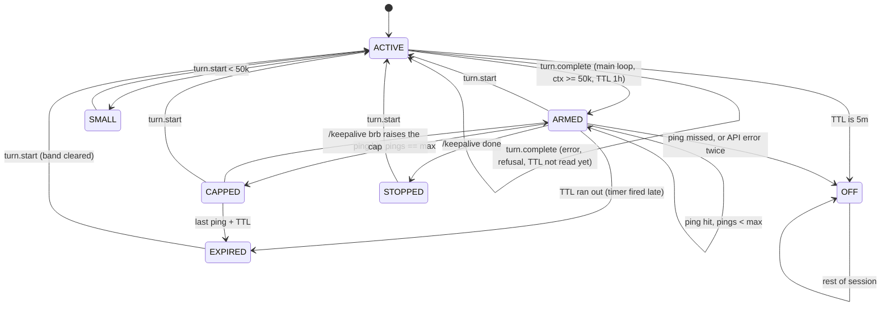

# cache-keepalive PRD

Status: v0.4, implemented as plugin 0.1.0 (2026-10-05). Built against Claude Code 2.1.289 and ccstatusline 2.2.30.

This document records what the plugin does and why each decision went the way it did. Findings marked **verified** were measured in a real session; **source** means read from the API types or ccstatusline's code.

## 1. Problem

Claude Code's prompt cache has a TTL (1 hour in the sessions measured here), and every cache hit restarts it. After an idle stretch longer than the TTL, the next request rewrites the whole context into the cache: it costs more and the first reply is slower.

The manual workaround is to send a throwaway message and rewind it later, but the cache needs keeping exactly when you are away from the keyboard. The plugin does the same thing automatically with `$.model.fork`: one tool-less request over the main thread's last prefix. The fork reads the prefix from cache, restarting the TTL, and **never lands in the transcript**, so there is nothing to rewind.

## 2. Cost model

A ping is not "under 100 tokens". The reply is a few tokens, but the request re-reads the whole prefix at the cache-read rate (0.1×). **Verified:** a ping over a 65.6k context read `cache_read 65757` and produced `output 4`.

For a 200k context on the 1h TTL (write 2×, read 0.1×), in base-input equivalents:

| | Cost |
|---|---|
| Rewrite after expiry | 400k |
| 1 ping (a meal) | 20k |
| 2 pings (default cap) | 40k |
| 4 pings (`/keepalive brb 220`) | 80k |

Break-even is about 20 pings (about 18 hours). Guessing wrong is cheap in one direction: an extra ping costs 5% of a rewrite. So the strategy is to keep warm by default with a short cap, and never try to predict whether you are at lunch or done for the day.

**5m TTL:** keeping a 5-minute cache warm needs a ping every 4–5 minutes, about 13 an hour at 0.1× = 1.3×, more than one 1.25× rewrite. A 5m TTL turns keepalive off.

## 3. Goals and non-goals

Goals:

- **G1** Coming back after up to 2 hours idle, the first request hits the cache.
- **G2** Nothing to do by default; forgetting about it is fine.
- **G3** The state is visible where you already look, without extra rows by default.
- **G4** Every ping is verified; a miss turns keepalive off.
- **G5** The status countdown reflects the real cache: it restarts after a ping.

Non-goals:

- Keeping warm while the Mac sleeps (the process sleeps too).
- Predicting "done" versus "at lunch".
- Codex support (Codex has no hook modules).

## 4. Scenarios

| Situation | You do | The plugin does |
|---|---|---|
| 1-hour lunch | nothing | pings once at TTL − 5 min; you return to a warm cache |
| 2-hour meeting | nothing | pings twice, then stops |
| Out for 3+ hours | `/keepalive brb 180` | raises the cap to `ceil(180 / 55)` = 4 |
| Done, closing the tab | close it | `session.end` cancels the timers and deletes the state file |
| Done, keeping the tab | `/keepalive done` (optional) | stops; skipping it wastes at most 2 pings |
| Back after it expired | nothing | a one-line band says what the next request rewrites, gone after your next prompt |
| Small context | nothing | under 50k tokens: not kept warm, a rewrite is cheap |
| 5m-TTL session | nothing | keepalive is off (section 2) |
| Working continuously | nothing | every `turn.start` cancels the timers |

## 5. Display

### 5.1 `$.ui.status` as the default: rejected

**Verified** in a 160×40 tmux capture: `$.ui.status` is drawn as its own row above ccstatusline, and the engine forces a warning glyph and the plugin name in front of it. It does not join the mode row.

```
  ⚠ keepalive-probe: 🔥42m
  📂 shdennlin │ ⌥ main  (+1,-0) │ ⎇ main │ Opus 5.5 · medium │ v2.1.289
  ctx ▓░ 14% │ cache 100% 🟢 59:41 │ 5h 28% ↻1h46m │ wk 15% │ $3.24 · 24m │ a23d2822
  -- INSERT -- ▸▸ auto mode on (shift+tab to cycle) · ← 1 agent
```

The plugin therefore calls `$.ui.status` only when the user opts in (`engineStatus`, 5.3).

### 5.2 The status line field (chosen)

The plugin writes data, not display text, to `~/.claude/keepalive/<session_id>.json`. `bin/keepalive-cache` turns it into a cache field and replaces ccstatusline's built-in Cache Timer:

```
ctx ▓░ 14% │ cache 100% 🟢 58:54 keep 1/2 │ 5h 28% ↻1h46m │ …
```

Why replace the built-in widget (**source:** ccstatusline 2.2.30 `CacheTimerWidget.render`): its countdown is `ttlSeconds` (a fixed widget setting) − 5 s − (now − the transcript's last non-sidechain assistant message). A ping never reaches the transcript, so after a ping the built-in countdown keeps falling to `❄️ COLD` while the cache is warm, and it never knows the real TTL. The script counts from `max(last assistant message, lastPingAt)` with the TTL the plugin read. With no state file it prints exactly what the built-in prints.

Markers: ccstatusline already uses 🔥 for a running turn, ❄️ for cold, and `↻` for the 5h reset timer, so the keepalive state is a plain `keep` tag:

| Phase | Field |
|---|---|
| active (turn running) | `🔥 HOT` |
| armed | `🟢 41:12 keep 0/2` |
| after a hit | `🟢 59:58 keep 1/2` (countdown restarted) |
| capped | `🟡 22:40 keep 2/2 ⏸` |
| stopped (`/keepalive done`) | `🟢 37:05 keep ⏸` |
| small context | `🟢 41:12` |
| off, 5m TTL | `🟢 3:41 keep off·5m` |
| off, miss or API error | `🟢 41:12 keep off` |
| expired | `❄️ COLD` |

**Redraws need `statusLine.refreshInterval`.** **Verified:** Claude Code reruns the status line only on events. After the timer rewrote the state file, the field kept its old value and ccstatusline's own countdown froze. Claude Code 2.1.289 has `statusLine.refreshInterval` (seconds, minimum 1). At 10 s, an external file change showed within about 6 s with no events. ccstatusline's "Refresh interval" menu item writes the same setting. Its custom-command cache TTL must stay 0 (the default).

### 5.3 Users without ccstatusline

The script reads the JSON Claude Code passes to every status line command (`session_id`, `transcript_path`), so it is not ccstatusline-specific:

- **Own status line script:** pipe the same stdin to `keepalive-cache` and print its output.
- **No status line:** make `keepalive-cache` the whole status line command, or turn on `engineStatus`. That option pushes `keep 1/2 · ping 23:22`-style text through `$.ui.status`, accepting the extra warning-prefixed row. It shows clock times, not a countdown, because it only updates on state changes, and it clears while a turn runs.
- **Nothing configured:** keepalive still works. The state shows through `/keepalive status`, the expired band and the off toast.

### 5.4 Band: only when you come back to an expired cache

When the cache expires during an idle stretch, an `AbovePrompt` band shows one line: when it expired, how much the next request rewrites, and a Dismiss button. It goes away at the next `turn.start` or on Dismiss. It is not shown for small contexts, a 5m TTL, or after `/keepalive done`, where expiry is expected.

### 5.5 No idle band: rejected

Considered: after N idle minutes, show `[+1h] [+3h] [stop]` above the prompt. No N works:

| When you'd press it | When the band must appear | N = 3 min | N = 30 min |
|---|---|---|---|
| Before leaving, `[+3h]` | while you're still here | in time, but pops up in every pause to read or think | you've already left |
| On return | before you return | — | visible, but nothing to press: typing restarts everything anyway |

The root cause is that a mod cannot detect that you left. The API has no terminal focus or idle event (`ui.focus` is the band's own focus ring; `Notification` is a timer underneath). So interaction is split: `/keepalive brb` before leaving (you are at the keyboard anyway), Telegram while away (v1.1, triggered by the cap being reached, not by guessing time), and the expired band on return.

## 6. Behavior

### 6.1 State machine (per session)



- **Main loop only.** `turn.start` fires only for model turns of the main loop (**source:** a subagent's run raises no `turn.start`; a mod slash command is not a model turn). `turn.complete` with an `agentId` is ignored.
- **Context size** comes from `$.session.usage().context.tokens`, the last response's input side. `turn.complete`'s `usage` is **summed over all API calls in the turn** (**source:** `ModelUsage` doc), so a multi-tool turn would overstate it several times over.
- `turn.start` cancels the timers and resets the ping count and cap. `/keepalive brb` affects the current idle stretch only.
- `OFF` is sticky for the session, except `offReason: 'disabled'`, which clears when `enabled` is turned back on.

### 6.2 Reading the TTL

| Source | Has the TTL? | |
|---|---|---|
| `turn.complete` / `$.model.fork` `usage` | No: only input, output, cache_read, cache_creation totals | **verified** |
| Transcript JSONL `message.usage.cache_creation` | Yes: `ephemeral_1h_input_tokens` / `ephemeral_5m_input_tokens` | **verified** (test session: 1h = 36912, 5m = 0) |
| `PostModelSwitch` hook input | Yes: `cache_ttl: '5m' \| '1h'` | **source**; only fires on a model switch |

- After each main-loop `turn.complete`, the plugin reads the transcript tail with `$.process.run(['tail', '-c', '262144', path])` (`$.fs.read` rejects files over 4 MiB, which long transcripts exceed). The newest main-loop assistant row with a non-zero 1h or 5m split decides. Taking the newest *non-zero* row means a row not yet flushed when the hook runs costs nothing.
- Transcript path: from the `classic.UserPromptSubmit` envelope (`transcript_path`), falling back to `<config dir>/projects/<cwd with non-alphanumerics as '-'>/<session_id>.jsonl`.
- No TTL read yet: nothing is scheduled; the next turn tries again.
- Ping time = `max(last response, last ping) + TTL − leadMinutes` (55 minutes for 1h).

### 6.3 Ping

```ts
const r = await $.model.fork({ prompt: 'Cache keep-alive ping, not a task. Reply with exactly: ok' })
// hit: r.usage.cache_read_input_tokens / (input + cache_read + cache_creation) >= 0.8
```

- The hit test uses the fork's own ratio, not an expected context size, because `turn.complete` usage is summed per turn (6.1). **Verified:** a timer fork read 65757 of 65800 prefix tokens (`cache_creation 0`). The first fork after a turn writes the last reply once (`cache_creation 176` measured).
- A miss → `OFF: ttl-mismatch`, with one toast. At most one wasted ping.
- `isAnswered: false`: `nothing-to-fork` → back to active; an API error or abort with nothing sent → retry once after 30 s, then `OFF: api-error`.
- If the timer fires after the TTL already ran out (the Mac slept), the ping is skipped and the phase goes to `EXPIRED`: it would pay a full rewrite and read as a miss.
- If a turn starts while the fork is in flight, its result is discarded.
- `ModelForkRequest` has only `prompt`: no `max_tokens` or effort, so the prompt itself keeps the reply short.

### 6.4 State file

```json
{"v":1,"phase":"armed","offReason":null,"ttlSec":3600,"lastPingAt":1791127200000,"pings":1,"max":2,"contextTokens":180000}
```

Written to `<CLAUDE_CONFIG_DIR or ~/.claude>/keepalive/<session_id>.json` on every state change. **Verified:** `$.fs.write` creates the folder. Deleted at `session.end` (**verified**: also on a terminal kill); files untouched for 7 days are swept at `session.start`. `$.fs` has no delete, so both use `rm -f` through `$.process.run`.

### 6.5 Commands

Command names allow only letters, digits, `_` and `-`, so the PRD's earlier `/keepalive:done` is impossible. One command takes a verb:

| Command | Behavior |
|---|---|
| `/keepalive done` | Stop for this idle stretch, until the next `turn.start` |
| `/keepalive brb <minutes>` | Cap for this idle stretch = `ceil(minutes / (TTL − lead))`, at least one more than pings sent |
| `/keepalive status` | Phase, TTL, context, pings, next ping and expiry, totals across sessions |

**`brb` completion.** `CommandSpec` has only `argumentHint`, but `prompt.edit` sees and rewrites the prompt box on every edit, so the plugin completes fish-style: after `/keepalive brb ` a dim `180` follows the cursor; typing `4` or `6` turns it into `480` or `60`; Right arrow accepts; Enter runs what the box shows. **Verified** key by key in a real session, including Backspace re-offering `180`. Limits, **verified** with a probe: Tab and Up/Down never reach `prompt.edit` (the editor keeps them), so there is no cycling; a burst (paste, tmux `send-keys` of a whole string) can outrun the redraw and leave `180480`.

### 6.6 Options (`userConfig`)

| Option | Default | |
|---|---|---|
| `enabled` | `true` | Master switch |
| `leadMinutes` | `5` | Ping this many minutes before the TTL ends |
| `maxPings` | `2` | Pings per idle stretch |
| `minContextTokens` | `50000` | Smaller contexts are not kept warm |
| `engineStatus` | `false` | Show the state through `$.ui.status` (5.3) |

### 6.7 Hot reload and state

- Module variables (timer handles, the completion tail) start over on a reload, and the engine drops the old timers. The session state lives in `$.state` (`cache-keepalive.session`, declared in `types/index.d.ts`), and `session.start`, which also fires on reload, re-arms from it.
- Totals across sessions (pings, hits) live in `$.store`.
- After `/clear`, the engine raises `session.end` and no `session.start`; the next turn runs under a new session id, and the plugin rebinds and resets on that.
- Authoring constraint: `claude plugin validate` refuses passing `$` to a function defined inside `register`. Helpers that take `$` are top-level functions.
- **Verified:** the hook budget (`HookBudget.ms`, 10 s) pauses during any `$` call, so `await $.model.fork` inside a hook costs nothing (budget 9994 ms before and after a 1753 ms fork). A fork inside a `$.clock.after` callback, using the `$` of a hook that had already returned, completed in 1568 ms.

## 7. Acceptance criteria

| | Criterion | Covered by |
|---|---|---|
| AC1 | No input for TTL − 5 min after a turn → exactly one ping; field shows `keep 1/2` | unit test; real timer ping verified (5-min lead, 2026-10-05) |
| AC2 | A ping adds nothing to the transcript | pending (real run) |
| AC3 | The next prompt after a ping reads about the whole context from cache | pending (real run) |
| AC4 | At `maxPings` no more pings; `⏸` | unit test |
| AC5 | `/keepalive done`, `session.end` and `turn.start` cancel the timers | unit tests |
| AC6 | Subagent turns neither arm nor cancel | unit test |
| AC7 | Context < 50k: no schedule, no `keep` tag | unit test |
| AC8 | A miss → `OFF: ttl-mismatch`, toast exactly once | unit test |
| AC9 | After a hot reload, timers re-arm from `$.state` | unit test (approximated by a second `session.start`) |
| AC10 | No extra row under the prompt unless `engineStatus` is on | unit test; verified in a real session |
| AC11 | After a hit, the countdown restarts near 59:5x | widget test |
| AC12 | A 5m TTL → off, `keep off·5m` | unit test |
| AC13 | Expired band appears once, dismisses, clears on the next turn | unit test, terminal and desktop |

## 8. Telegram two-way prompt (v1.1, implemented)

When the pings run out (CAPPED), the plugin sends one message to the chat session-notifier already posts to, with the same `<b>project</b> · <i>session title</i>` header:

> **shdennlin** · *mod*
> 🧊 Cache expires at **01:12** · 180k context
> Rewrite ≈ 360k · one more hour warm ≈ 18k
> `[+1h]` `[+3h]` `[Let it expire]`

- **Sending:** `$.http.fetch` to the Bot API, `parse_mode: HTML`, `callback_data` = `ka:<first 8 chars of session id>:<minutes>`, well under the 64-byte limit.
- **Receiving:** the Mac has no public address, so pushes are impossible. While a question is open, a `$.clock.every(10 s)` poller calls `getUpdates` with `timeout=0`. It stops on an answer, on return to the keyboard, on expiry, on `/keepalive done` and at session end, each of which edits the message to show the outcome and drop its buttons.
- **No offset confirmation.** The bot is shared by several sessions and, judging by the chat, more than one machine. Confirming an offset deletes every earlier update for every reader, and a shared inbox file would only coordinate one machine. Instead each reader reads everything pending and takes only updates whose `callback_data` names its session, whose message is its question, and whose sender is the configured user. This holds because privacy mode keeps the pending set to button presses and replies to the bot, few enough for the 100-per-call limit, and Telegram drops them after 24 hours.
- **Text replies:** a reply to the question message with `120`, `2h`, `45m` or `stop` counts as an answer.
- **Semantics:** each ping adds one interval (TTL − lead). `+1h` = 1 more ping, `+3h` = 3, `2h` = 2 (rounded, so "+1h" does not cost two pings). "Let it expire" → STOPPED.
- **Token:** `telegramBotToken` (sensitive `userConfig`), then `CLAUDE_KEEPALIVE_TELEGRAM_BOT_TOKEN`, then the macOS Keychain item `claude-code.cache-keepalive` (account `telegram-bot-token`). A mod cannot read another plugin's secrets, so session-notifier's token cannot be borrowed: `$.config.list` lists non-secret fields only, and `CLAUDE_PLUGIN_OPTION_*` reaches only that plugin's own hook processes.
- **Why not reuse session-notifier itself:** it is shell hooks, one short process per event. It can send but cannot hold a poller open for the answer.

**Verified** against the real bot (`shdennlin_life_bot`): privacy mode on (`can_read_all_group_messages: false`), no webhook, and a message sent to the bot was still pending afterwards, so no other program consumes its updates.

**End-to-end run, 2026-10-05** (throwaway session, 60k context, `maxPings: 1`, `leadMinutes: 55` so the ping came 5 minutes after the turn):

| Time | Event |
|---|---|
| 10:14 | Turn ends; armed, TTL read as 60 min, Telegram on (token from the Keychain) |
| 10:19:38 | Timer ping, hit; CAPPED; question sent to the CC group |
| 10:33:12 | `[+3h]` pressed on the phone; picked up by the next poll; armed again |
| 10:33 | The overdue ping fired at once and hit; the message showed "✅ Keeping it warm until …" with its buttons gone |

The test settings stretched `+3h` into 36 pings, because each ping only added 5 minutes. With the real 55-minute interval it is 3. The session was closed right after.

Decisions from the run:

- **No cap on extensions.** Each answer covers one stretch: when its pings run out the session is CAPPED again and asks again. A text reply can ask for up to `24h` (about 26 pings, more than one rewrite on a 200k context), but that is an explicit choice.
- **A question can scroll out of sight** under session-notifier's messages in a busy group. Missing it costs what keepalive saves, a rewrite, so it is left as is for the week of own use.
- **Answered updates are remembered** (`tgHandled` in `$.store`, last 200 ids). Updates stay pending because no offset is confirmed, so without this one press could count again.

## 9. Risks

| # | Risk | Handling | Result |
|---|---|---|---|
| V1 | Can `$.fs.write` write `~/.claude/keepalive/<id>`? | absolute path, id from `$.session.id()` | **verified** |
| V2 | Can a status line command get `session_id` and show the field on line 2? | read it from stdin JSON | **verified** in tmux |
| R1 | 10 s hook budget around `await fork` in a timer | await directly | **verified** with 3 s and 5 min timers; the 55-min gap is pending |
| R2 | Is the session really 1h TTL? | read from the transcript (6.2) | **verified** for test sessions |
| R3 | No schedule while a turn waits on a permission prompt | not handled in v1 | open |
| R4 | How much of a Max plan's usage limit a ping uses | watch the 5h / weekly percentages for a week | open |
| R5 | Extended thinking before `ok` | watch `output_tokens` | small context: 4 tokens |
| R6 | Prefix changes (`/model`, a reload changing system prompt or tools) | the hit test catches it; one wasted ping | open |
| R7 | Mac sleep | known limit; late timers skip the ping | skip logic untested (the mock clock cannot model sleep) |
| R8 | The built-in cache countdown ignores pings | replacement widget (5.2) | **source** confirmed, fixed |
| R9 | Status line frozen while idle | `refreshInterval` | **verified** |
| R10 | Calling `$.ui.status` brings back the warning row | only behind `engineStatus` | **verified**, unit test |
| R11 | Transcripts over 4 MiB | `tail -c` | the `tail -c` read is **verified** in a real session; a transcript over 4 MiB is untested |
| R12 | `$.ui.toast` may carry the same forced prefix as `$.ui.status` | only used once, on OFF | not observed yet |
| R13 | A Telegram question lost among other messages in the group | observe for a week | open |

## 10. Release plan

1. Commit to the repo, not yet in `marketplace.json`.
2. One real 55-minute run for AC1–AC3, AC11 and R1.
3. A week of own use: R4 numbers and the ping hit rate go into the README.
4. Then register in `marketplace.json` as an experimental 0.x plugin. Every other plugin here ships `.codex/INSTALL.md`; this one cannot, so the README says Claude Code only. The mod API is early access and moves between releases, so expect upkeep on Claude Code updates.
