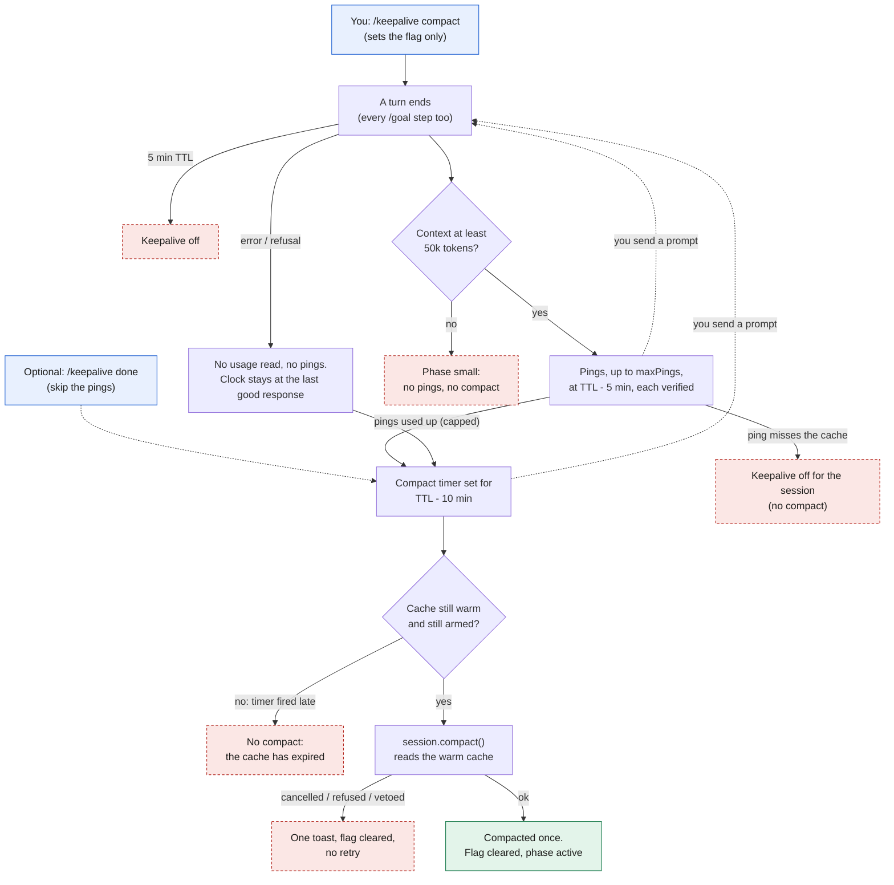

# Compact before expiry

Part of [cache-keepalive](../README.md).

For when you step away, or leave a `/goal` running while you sleep: run `/keepalive compact` first. Keepalive keeps pinging as usual; once the pings run out, it compacts `compactLeadMinutes` (10) before the cache expires instead of letting it lapse. The summary request only has to start before the expiry, but the extra minutes absorb a retry or a late timer. The summary request is a fork of the same prefix and reads the warm cache: one measured run on a 142k-token context read 98% of the prefix from the cache and wrote 526 tokens. Your next prompt then rewrites a small summary instead of the whole old context.

- **No pings, just the compact.** Add `/keepalive done` (before or after): the pings stop and the compact runs in the first lead window, about 50 minutes after the last turn on a 1h TTL. `done` ends at your next prompt, though, so a `/goal`'s first turn brings the pings back; for a goal use `maxPings: 0` instead.
- **One time.** It fires once, then clears. `/keepalive compact off` cancels it.
- **It clears when you come back.** A plain prompt you type (not a slash command) cancels it and shows a toast, so it cannot fire in some later idle stretch you forgot about. A slash command does not count (you arm it, then type `/goal`), and neither does a prompt the engine wrote, such as a `/goal` continuation (its `source` is not `user`). Some builds leave `source` out; there, a `/goal` continuation was measured to raise no prompt event at all, so only what you type clears it. New turns do not drop it, so a `/goal` does not either; the idle countdown only starts after the goal ends.
- It fires only in the `capped` phase, so `brb` or a Telegram answer that adds pings postpones it. If the timer fires after the cache already expired (the Mac slept), it does nothing. If you cancel the compaction or the host refuses it, it is not retried.
- Set the `compactBeforeExpiry` option to make it the default for every idle stretch instead of arming it each time. Set `maxPings` to `0` to compact at the first lead window with no pings.
- After it runs, nothing is kept warm until your next turn: the new prefix is not cached yet.
- `/keepalive status` shows `compact before expiry: armed, at HH:MM`.

## Flow chart

Solid arrows are the main path, dashed arrows are optional or restart it. Red boxes end early: nothing is compacted and the cache expires on its own. Typing a prompt at any point cancels the timers. A plain prompt also clears the armed flag; a slash command or a `/goal` continuation keeps it, and the flow restarts when that turn ends.

## Timeline

Times are minutes after the last turn ends, with the defaults: 1h TTL, `leadMinutes` 5, `compactLeadMinutes` 10, `maxPings` 2, and `/keepalive compact` armed.

```mermaid
gantt
  title Time after the last turn ends (hh:mm, defaults, compact armed)
  dateFormat HH:mm
  axisFormat %H:%M
  section Cache
    Warm, nothing happens             :done, w1, 00:00, 55m
    Ping 1, cache now lasts to 1h55   :milestone, p1, 00:55, 0m
    Warm after ping 1                 :done, w2, 00:55, 55m
    Ping 2, pings used up, lasts to 2h50 :milestone, p2, 01:50, 0m
    Warm after ping 2                 :done, w3, 01:50, 50m
  section Compact
    Compact window, starts at 2h40    :crit, c, 02:40, 10m
    Old cache would have expired      :milestone, x, 02:50, 0m
```

The axis is time since the last turn ended, drawn to scale. The red bar is the 10-minute window `compactLeadMinutes` leaves before the cache would expire, not how long the compaction takes (about a minute at 140k tokens).

- **0 → 55:** nothing happens. The cache is warm and the clock runs from the last response.
- **55 and 110:** each ping reads the whole prefix, which restarts the 60-minute clock, so the cache would now expire at 115, then at 170. A ping starts `leadMinutes` (5) before the current expiry, hence a 55-minute interval.
- **After ping 2** the pings are used up (`capped`), so the compact is scheduled for the second lead window: expiry 170 − `compactLeadMinutes` 10 = **160**.
- **160:** the summary request starts and reads the warm cache. It takes about a minute at 140k tokens (more on a bigger context), so it is done well before 170. The cache now holds a prefix that no longer exists, and nothing is kept warm.
- **After 160:** your next prompt rewrites the small summary instead of the old context.

The same rule gives these variants (still minutes after the last turn):

| Setup | Pings | Compact |
|---|---|---|
| `/keepalive compact` (above) | 55, 110 | 160 |
| `maxPings` 0 | none | 50 |
| `/keepalive done` then `/keepalive compact` | none | 50 |
| `/keepalive brb 180` then `/keepalive compact` | 55, 110, 165, 220 | 270 |
| you send a prompt at any point | cancelled | cancelled, still armed; the timeline restarts when that turn ends |

The formula is `last response + pings × 55 + (60 − compactLeadMinutes)` minutes. `/keepalive status` and the status line show the result as a clock time, for example `✂13:13`. It is an estimate: if a ping misses the cache, keepalive turns itself off for the session and no compact happens.
